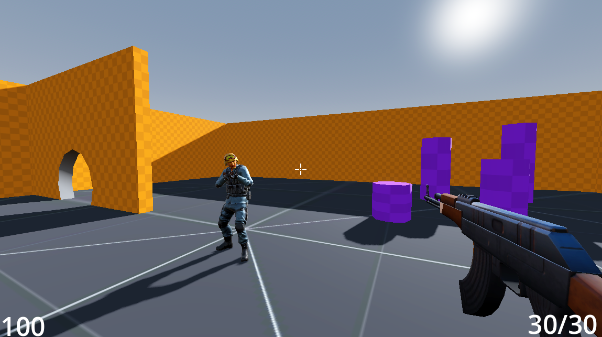
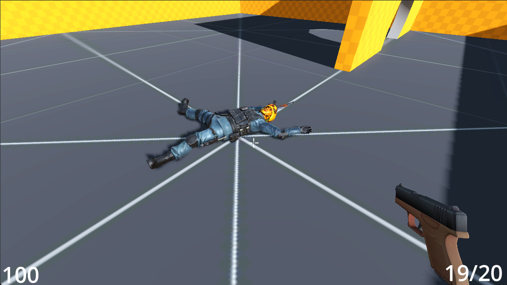

# Godot Multiplayer Project

*A simple 1v1 arena FPS multiplayer game.*

**Join via LAN, shoot your opponent, and respawn to keep playing.**

**Players can choose between two weapons: AK-47 and Glock.**

---

## Features
- **Multiplayer ready:** Fully functioning LAN-based 1v1 matches  
- **Respawn system:** Shoot, die, and immediately get back into the arena  
- **Barebones but functional:** Perfect for testing multiplayer concepts  

## Tech Learned
- High-level and low-level networking in Godot  
- RPC calls and proper server/client data handling  
- Player animations and syncing across network  
- Deciding what data should be local vs sent to the server  

## How to Play
1. Extract `project.7z` to a folder  
2. Run the executable (`.exe`) inside the extracted folder  
3. **Join via LAN** – Enter the host IP to connect
4. **Movement:** WASD keys and space
5. **Shooting:** Left mouse click  
6. **Switch weapons:** Number keys 1 (Glock) or 2 (AK-47) 

---

## Notes
This is a personal testing project to learn multiplayer in Godot.  
The game is minimal but has a fully working networked 1v1 system ready for expansion.
